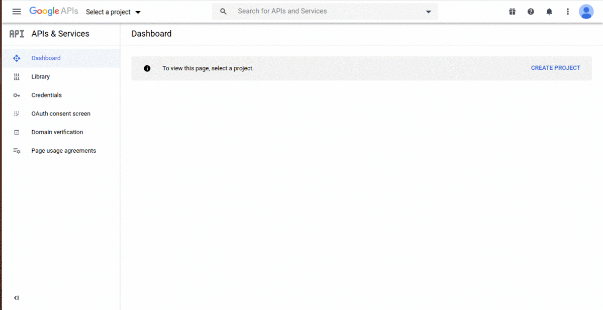

# Getting started with Google Calender API With Service Account

---

*A service account is a special type of Google account intended to represent a non-human user that needs to authenticate and be authorized to access data in Google APIs.*

---

---

# Steps to download client_secret file

1. Go to the following link: [https://console.developers.google.com/](https://console.developers.google.com/)

  You are now at the dashboard.

2. Create a new project and name it "*RobocompActivityAPI*"

3. After creating a new project click on the Enable API & Services.

  Now find the Google calendar API and click it\
  Enable it or if already enable then click on manage

4. Click on credential on the left side under service account.

5. Click on manage service accounts
6. Then click on Create service account on the top

    Create a service account name "RobocompAPI"\
    Leave all the optional.

7. Click on the three dots under the action column and
create new key

  Select key type as json and download

> rename the file as client_secret.json


8. Copy the service account email which in my case it is "*robocompapi@robocompactivityapi.iam.gserviceaccount.com*"


> place the downloaded client_secret.json file in  \<humanObserverAgent_GUI path>


9. Open the google_calender.py inside the src folder and rename line no 14

```
self.service_account_name = 'testacc@robocompgui-1591069682447.iam.gserviceaccount.com'
```

Change the service_account_name with your service account name\
In my case it is "*robocompapi@robocompactivityapi.iam.gserviceaccount.com*"


10. You can now use the gui, and the changese are now linked with this service account.

**but wait...** tThese changes cannot be seen on the google calendar on browser as
this is a service account whcih is a dummy account and can not be access directly..

11. So to view as well as to create or edit the events on google calendar browser, we need
to give access of this account's calendar to any other google account.

**we can achieve this using the API itself,**

12. Follow these steps to give access.
  * open terminal
  * Go to the <humanObserverAgent_GUI path>
  * open python3 shell
  * run the following
  ```bash
  kati@kari-PC:~/robocomp/components/robocomp-viriato/components/humanObserverAgent_GUI$ python3
  Python 3.6.9 (default, Jul 17 2020, 12:50:27)
  [GCC 8.4.0] on linux
  Type "help", "copyright", "credits" or "license" for more information.
  >>> from src.google_calender import CalenderApi
  >>> Mycalender = CalenderApi()
  >>> Mycalender.giveAccess("rahulkatiyar19955@gmail.com")
  'user:rahulkatiyar19955@gmail.com'
  >>> exit()
  ```

13. go to calendar.google.com

14. add subscribe to a calendar and paste the service account email id as url

15. A new calender is now added to yours calendar list


  **Done**

---
**now you can create/modify/delete events directly from the browser**
